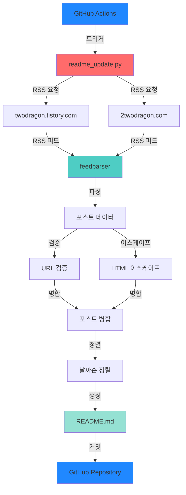
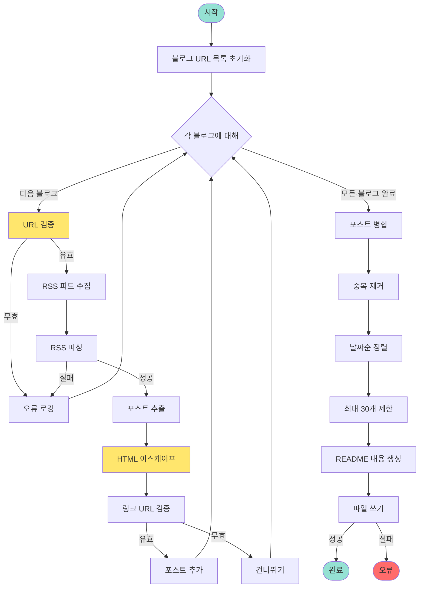
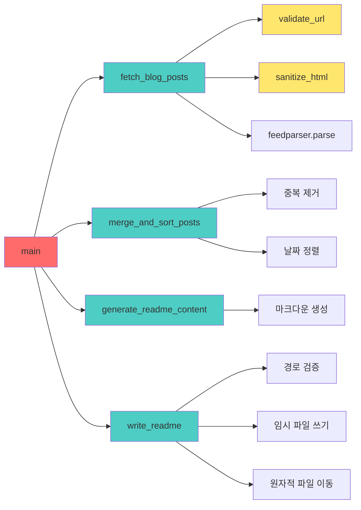
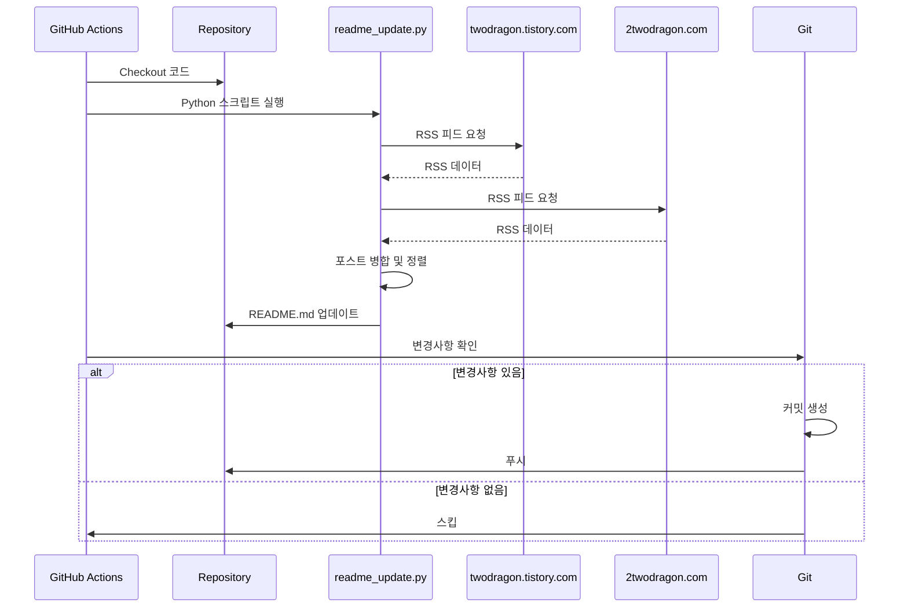

# 📝 Blog RSS Feed Collector

GitHub 프로필 README를 자동으로 업데이트하는 Python 스크립트입니다. 여러 블로그의 RSS 피드를 수집하여 최신 포스트 목록을 GitHub README에 자동으로 반영합니다.

## ✨ 주요 기능

- 🔄 **다중 블로그 지원**: 여러 블로그의 RSS 피드를 동시에 수집
- 🔒 **보안 강화**: URL 화이트리스트, HTML 이스케이프, Path Traversal 방지
- 📊 **자동 정렬**: 날짜순 정렬 및 중복 제거
- 🤖 **자동화**: GitHub Actions를 통한 자동 업데이트
- 🛡️ **보안 모범 사례**: OWASP Top 10 2025 준수

## 📋 목차

- [설치](#-설치)
- [사용법](#-사용법)
- [프로젝트 구조](#-프로젝트-구조)
- [아키텍처](#-아키텍처)
- [보안](#-보안)
- [기여](#-기여)
- [라이선스](#-라이선스)

## 🚀 설치

### 필수 요구사항

- Python 3.11 이상
- pip 패키지 관리자

### 설치 단계

1. 저장소 클론:
```bash
git clone https://github.com/Twodragon0/Blog.git
cd Blog
```

2. 의존성 설치:
```bash
pip install -r requirements.txt
```

## 💻 사용법

### 로컬 실행

```bash
python readme_update.py
```

스크립트가 실행되면:
1. 설정된 블로그에서 RSS 피드를 수집
2. 포스트를 병합하고 날짜순으로 정렬
3. `README.md` 파일을 자동으로 업데이트

### GitHub Actions 자동화

이 프로젝트는 GitHub Actions를 통해 자동으로 실행됩니다:

- **스케줄 실행**: 매일 한국시간 오전 9시 (UTC 00:00)
- **수동 실행**: GitHub Actions에서 `workflow_dispatch` 사용
- **자동 커밋**: 변경사항이 있을 때만 자동으로 커밋

## 📁 프로젝트 구조

```
Blog/
├── .github/
│   ├── workflows/
│   │   ├── main.yml              # 메인 워크플로우
│   │   └── update-readme.yml     # README 업데이트 워크플로우
│   └── dependabot.yml            # Dependabot 설정
├── readme_update.py               # 메인 스크립트
├── requirements.txt               # Python 의존성
├── README.md                      # 프로젝트 문서 (자동 업데이트)
├── SECURITY.md                    # 보안 정책
├── .cursorrules                   # 코딩 가이드라인
└── tistory_rss_python.ipynb      # Jupyter 노트북 예제
```

## 🏗️ 아키텍처

### 시스템 아키텍처 다이어그램



### 코드 플로우 다이어그램



### 함수 호출 관계 다이어그램



## 🔒 보안

이 프로젝트는 보안을 최우선으로 고려하여 설계되었습니다:

### 보안 기능

- ✅ **URL 화이트리스트**: 허용된 도메인만 접근 가능
- ✅ **HTML 이스케이프**: XSS 공격 방지
- ✅ **Path Traversal 방지**: 파일 시스템 보호
- ✅ **원자적 파일 쓰기**: 데이터 무결성 보장
- ✅ **에러 처리**: 민감한 정보 노출 방지

### 보안 모범 사례

- OWASP Top 10 2025 준수
- 입력 검증 및 출력 인코딩
- 최소 권한 원칙 적용
- 안전한 로깅 (민감 정보 제외)

자세한 내용은 [SECURITY.md](SECURITY.md)를 참조하세요.

## 🔄 GitHub Actions 워크플로우

### 워크플로우 다이어그램



## 📊 데이터 플로우

```mermaid
graph LR
    A[RSS 피드] -->|XML| B[feedparser]
    B -->|파싱| C[Entry 객체]
    C -->|추출| D[title, link, published]
    D -->|검증| E[URL 검증]
    E -->|이스케이프| F[HTML 이스케이프]
    F -->|구조화| G[Post 딕셔너리]
    G -->|병합| H[포스트 리스트]
    H -->|정렬| I[정렬된 리스트]
    I -->|템플릿| J[마크다운 문자열]
    J -->|파일 쓰기| K[README.md]
    
    style A fill:#95e1d3
    style B fill:#4ecdc4
    style G fill:#ffe66d
    style K fill:#ff6b6b
```



## 🛠️ 개발

### 코드 스타일

이 프로젝트는 `.cursorrules`에 정의된 보안 우선 코딩 가이드라인을 따릅니다.

### 테스트

```bash
# 스크립트 실행 테스트
python readme_update.py

# 로그 확인
# 스크립트는 자세한 로깅을 제공합니다
```

### 의존성 관리

Dependabot이 자동으로 의존성을 모니터링하고 업데이트합니다:
- 주간 스캔
- 보안 취약점 자동 감지
- PR 자동 생성

## 📝 설정

### 블로그 URL 변경

`readme_update.py`의 `main()` 함수에서 블로그 URL을 수정할 수 있습니다:

```python
blog_urls = [
    "https://twodragon.tistory.com",
    "https://2twodragon.com"
]
```

### 최대 포스트 수 변경

`MAX_POSTS` 상수를 수정하여 수집할 최대 포스트 수를 변경할 수 있습니다:

```python
MAX_POSTS = 30  # 원하는 숫자로 변경
```

## 🤝 기여

기여를 환영합니다! 기여하기 전에 다음을 확인하세요:

1. 이슈를 생성하여 변경사항을 논의하세요
2. Fork하고 새 브랜치를 생성하세요 (`git checkout -b feature/AmazingFeature`)
3. 변경사항을 커밋하세요 (`git commit -m 'Add some AmazingFeature'`)
4. 브랜치에 푸시하세요 (`git push origin feature/AmazingFeature`)
5. Pull Request를 생성하세요

### 보안 취약점 보고

보안 취약점을 발견한 경우, 공개 이슈로 보고하지 마시고 [SECURITY.md](SECURITY.md)의 절차를 따르세요.

## 📄 라이선스

이 프로젝트는 MIT 라이선스를 따릅니다.

## 👤 작성자

**Twodragon**

- 블로그: [twodragon.tistory.com](https://twodragon.tistory.com)
- 웹사이트: [2twodragon.com](https://2twodragon.com)
- 이메일: twodragon114@gmail.com

## 🙏 감사의 말

- [github-readme-stats](https://github.com/anuraghazra/github-readme-stats) - GitHub 통계 이미지
- [feedparser](https://github.com/kurtmckee/feedparser) - RSS 피드 파싱 라이브러리

---

###  🐱 github stats  

<div align="center">
  
  
</div>

###  💁 About Me  
<p align="center">
    <a href="https://twodragon.tistory.com/"></a>
    <a href="https://2twodragon.com/"></a>
    <a href="mailto:twodragon114@gmail.com"></a>
</p>

<br>

## Recent blog posts
